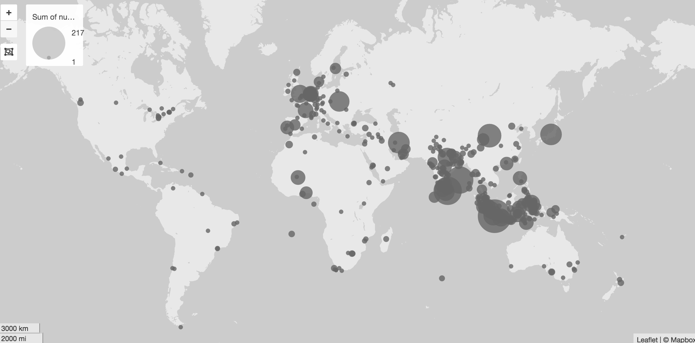

# Visualiseren van de geografische zaaktrefwoorden

De trefwoorden van geografische trefwoorden gaan we visualiseren met behulp van [Palladio](http://hdlab.stanford.edu/palladio-app), een tool van Stanford, die (ook) zonder installatie online gebruikt kan worden. Palladio heeft wel coordinaten nodig en niet alleen plaatsnamen.

Open Refine claimt dat het direct via google plaatsnamen kan queryen, maar dat is ons niet gelukt. Bovendien heb je om meer dan een paar plaatsnamen te queryen bij Google Maps (en alle soortgelijke diensten) een 'developer key nodig'. Die kun je aanvragen bij de Google Maps site. In ons geval heet hij 'key'.

Voor het queryen gebruiken we het python _geocoder_ package (installeer met ```pip install geocoder ```), voor csv handling het _csv_ package uit de python standard library.


```python
import geocoder
import csv

key = open('googlekey.txt').read()
# read in csv file with the csv module
infl = open('<your location>/datasets_dag2/genormaliseerde_bestanden/13_geo.csv') # for this example
r = csv.DictReader(infl, delimiter=";")
rows = [row for row in r]
places = [row['sorteerwoord'] for row in rows]


# get the geocode for places
res = []
for p in places:
    g = geocoder.google(p, key=key)
    res.append({p: g.geojson})
```

Mijn sessie is nooit geëindigd. Bovendien y session did never finish, but the number of results was enough to demo. Google maps could not resolve many of the places.

```python
#  join the original file with relevant information from the geocoding:\n",
# country,county,lat and lng
# as the geocoder knows many more places in the US than outside of it and this source does not deal with the US, we kick out all results with a US country

for item in nrows:
    ires = {'keyword': item}
    ires['aantal'] = nrows.get(item)
    if result.get(item):
        for i in result.get(item).get('features'):
            if i.get('properties').get('country', '') != 'US':
                pr = i.get('properties')
                for k in ['country','county','lat','lng']:
                    ires[k] = pr.get(k, '')
    nresult.append(ires)

# should have excluded Canada as well
# write result to csv file for further analysis

```

Vervolgens voeren we het resulterende csv bestand aan Palladio, met het volgende resultaat (screenshot)




Hoewel dit geenszins volledig is en de data ook verder opgeschoond zouden moeten worden, geeft dit toch een goed inzicht in de geografische aandacht in een deel Generale Missiven.
